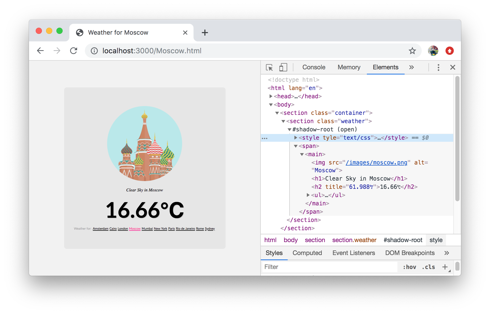

> Utilise Shadow DOM in React with all the benefits of style encapsulation.


&nbsp;

&nbsp;

&nbsp;


* **npm**: `npm i react-shadow --save`
* **Heroku**: [http://react-shadow.herokuapp.com/](http://react-shadow.herokuapp.com/)



---

## Getting Started

By using `ReactShadow` you have all the benefits of [Shadow DOM](https://www.w3.org/TR/shadow-dom/) in React.

```javascript
import ShadowDOM from 'react-shadow';

export default props => {

    return (
        <ShadowDOM include={['css/core/calendar.css', props.theme]}>
            <h1>Calendar for {props.date}</h1>
        </ShadowDOM>
    );

}
```

In the above example the `h1` element will become the host element with a shadow boundary &mdash; and the two defined CSS documents will be fetched and appended.

## Preventing FOUC

As the CSS documents are being fetched over the network, the host element will have a `className` of `resolving` for you to avoid the dreaded [FOUC](https://en.wikipedia.org/wiki/Flash_of_unstyled_content). Once **all** of the documents have been attached the `className` will change to `resolved`.

Using the `resolved` class name you could then allow the component to appear once all styles have been applied.

```css
.component {
    opacity: 0;
    transform: scale(.75);
    transition: all .35s cubic-bezier(0.175, 0.885, 0.32, 1.275);
}

.component.resolved {
    opacity: 1;
    transform: scale(1);
}
```

## Cached Documents

Oftentimes components share the same documents, however only **one** instance will be fetched due to `memoize` of the [`fetchInclude`](https://github.com/Wildhoney/ReactShadow/blob/master/src/react-shadow.js#L34-L45) function.

## Inline Styles

Instead of defining external CSS documents to fetch, you could choose to add all of the component's styles to the component itself by simply embedding a `style` node in your component. Naturally all styles added this way will be encapsulated within the shadow boundary.

```javascript
export default props => {

    const styles = `:host { background-color: ${props.theme} }`;

    return (
        <ShadowDOM>
          <div>
            <h1>Calendar for {props.date}</h1>
            <style type="text/css">{styles}</style>
          </div>
        </ShadowDOM>
    );
}
```

> **Note**: Using inline styles will **not** combine styles into one `style` node.
